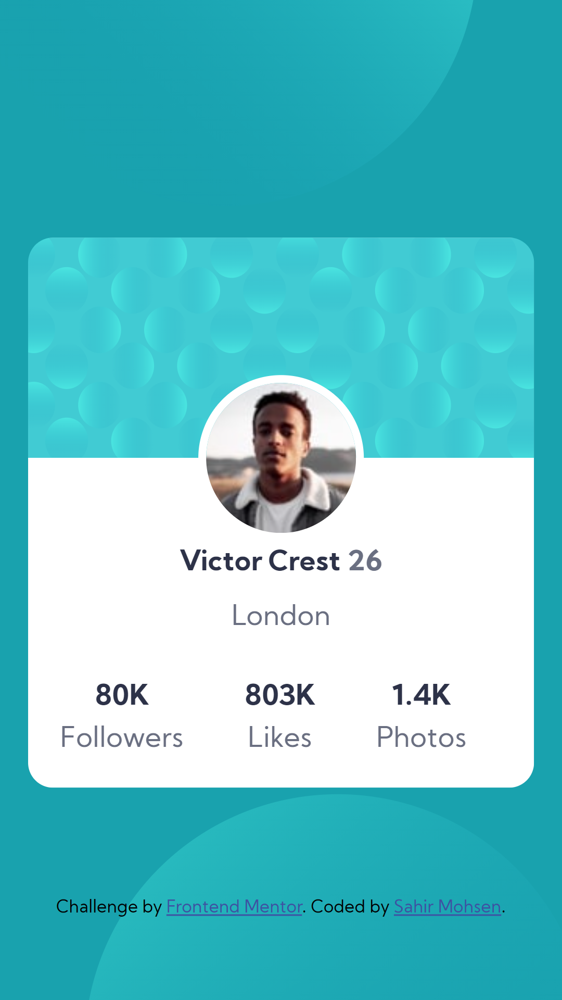

# Frontend Mentor - Profile card component solution

This is a solution to the [Profile card component challenge on Frontend Mentor](https://www.frontendmentor.io/challenges/profile-card-component-cfArpWshJ). Frontend Mentor challenges help you improve your coding skills by building realistic projects.

## Table of contents

- [The challenge](#the-challenge)
- [Screenshot](#screenshot)
- [Links](#links)
- [Built with](#built-with)
- [Author](#author)
- [Acknowledgments](#acknowledgments)

### The challenge

- Build out the project to the designs provided

### Screenshot

### Links

- Solution URL: [Add solution URL here](https://github.com/sahir2008/profile-card-component)
- Live Site URL: [Add live site URL here](https://frontend-profile-card-component.netlify.app/)

### Built with

- Semantic HTML5 markup
- CSS custom properties
- Flexbox

## Author

- LinkedIn - [Sahir Mohsen](https://www.linkedin.com/in/sahir-mohsen-602706128/)
- Frontend Mentor - [@sahir2008](https://www.frontendmentor.io/profile/sahir2008)
- Github - [@sahir2008](https://github.com/sahir2008)

## Acknowledgments

This is where you can give a hat tip to anyone who helped you out on this project. Perhaps you worked in a team or got some inspiration from someone else's solution. This is the perfect place to give them some credit.

Special Thanks To :

- Ahmed Mohsen - [@AhmedMohsen600](https://www.frontendmentor.io/profile/AhmedMohsen600)
